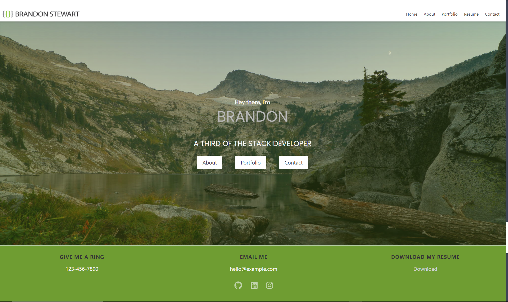

<br />
<br />
<p align="center">


  <h1 align="center">React Portfolio</h1>

  <p align="center">
    A React portfolio demonstrating my latest projects.
    <br />
    <a href="https://github.com/brandon-stewart-rgb/grumpy-milkshake"><strong>Explore the docs »</strong></a>
    <br />
    <br />
    <a href="https://brandon-stewart-rgb.github.io/grumpy-milkshake/">VIEW LIVE SITE</a>
    ·
    <a href="https://github.com/brandon-stewart-rgb/grumpy-milkshake/issues">Report Bug</a>
    ·
    <a href="https://github.com/brandon-stewart-rgb/grumpy-milkshake/issues">Request Feature</a>
  </p>
</p>


<!-- TABLE OF CONTENTS -->
<details open="open">
  <summary>Table of Contents</summary>
  <ol>
    <li>
      <a href="#about-the-project">About The Project</a>
      <ul>
        <li><a href="#built-with">Built With</a></li>
      </ul>
    </li>
    <li>
      <a href="#getting-started">Getting Started</a>
      <ul>
        <li><a href="#prerequisites">Prerequisites</a></li>
        <li><a href="#installation">Installation</a></li>
      </ul>
    </li>
    <li><a href="#usage">Usage</a></li>
    <li><a href="#roadmap">Roadmap</a></li>
    <li><a href="#contributing">Contributing</a></li>
    <li><a href="#license">License</a></li>
    <li><a href="#contact">Contact</a></li>
    <li><a href="#acknowledgements">Acknowledgements</a></li>
  </ol>
</details>


<!-- ABOUT THE PROJECT -->
## About The Project




### Built With

This section should list any major frameworks that you built your project using. Leave any add-ons/plugins for the acknowledgements section. Here are a few examples.
* [Node.js](https://getbootstrap.com)
* [React](https://jquery.com)
* [Bulma](https://bulma.io/)
* [Photoshop](https://www.adobe.com/)
* [Illustrator](https://www.adobe.com/)


<!-- GETTING STARTED -->

### Prerequisites

This is an example of how to list things you need to use the software and how to install them.
* Node.js
  ```sh
  https://nodejs.org/en/
  ```

### Installation

# Getting Started with Create React App

This project was bootstrapped with [Create React App](https://github.com/facebook/create-react-app).

## Available Scripts

In the project directory, you can run:

### `npm start`

Runs the app in the development mode.\
Open [http://localhost:3000](http://localhost:3000) to view it in the browser.

The page will reload if you make edits.\
You will also see any lint errors in the console.

### `npm test`

Launches the test runner in the interactive watch mode.\
See the section about [running tests](https://facebook.github.io/create-react-app/docs/running-tests) for more information.

### `npm run build`

Builds the app for production to the `build` folder.\
It correctly bundles React in production mode and optimizes the build for the best performance.

The build is minified and the filenames include the hashes.\
Your app is ready to be deployed!

See the section about [deployment](https://facebook.github.io/create-react-app/docs/deployment) for more information.

### `npm run eject`
 

<!-- USAGE EXAMPLES -->
## Usage

Use this software at your own risk, the content is copyrighted.


<!-- ROADMAP -->
## Roadmap

See the [open issues](https://github.com/brandon-stewart-rgb/grumpy-milkshake/issues) for a list of proposed features (and known issues).


<!-- CONTRIBUTING -->
## Contributing

Contributions are what make the open source community such an amazing place to learn, inspire, and create. Any contributions you make are **greatly appreciated**.

1. Fork the Project
2. Create your Feature Branch (`git checkout -b feature/AmazingFeature`)
3. Commit your Changes (`git commit -m 'Add some AmazingFeature'`)
4. Push to the Branch (`git push origin feature/AmazingFeature`)
5. Open a Pull Request


<!-- LICENSE -->
## License

Distributed under the MIT License. See `LICENSE` for more information.


<!-- CONTACT -->
## Contact

Brandon Stewart -  - brandon@brandon.com

Project Link: [https://github.com/brandon-stewart-rgb/grumpy-milkshake](https://github.com/brandon-stewart-rgb/grumpy-milkshake)


<!-- ACKNOWLEDGEMENTS -->
## Acknowledgements
* [GitHub Emoji Cheat Sheet](https://www.webpagefx.com/tools/emoji-cheat-sheet)
* [Img Shields](https://shields.io)
* [Choose an Open Source License](https://choosealicense.com)
* [GitHub Pages](https://pages.github.com)
* [Animate.css](https://daneden.github.io/animate.css)
* [Loaders.css](https://connoratherton.com/loaders)
* [Slick Carousel](https://kenwheeler.github.io/slick)
* [Smooth Scroll](https://github.com/cferdinandi/smooth-scroll)
* [Sticky Kit](http://leafo.net/sticky-kit)
* [JVectorMap](http://jvectormap.com)
* [Font Awesome](https://fontawesome.com)


